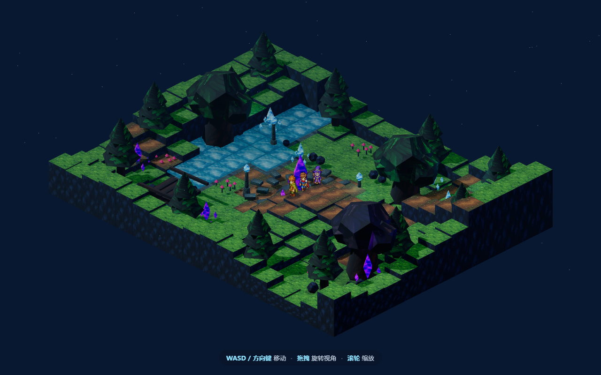

<div align="center">

# 🌲 神秘森林 · 体素探险

**一片会发光的低多边形森林，一场随点随玩的浏览器夜游。**

带上你的三位伙伴，穿过石桥、溪流与巨树，在紫色水晶与灯笼的微光里散步。

打开网页就能走，不用下载、不用注册。

[](https://threejs.org/)
[](https://vitejs.dev/)
[](https://www.typescriptlang.org/)
[](LICENSE)

### 👉 [点这里，进森林走一圈](https://shushuitie2017.github.io/forest-three/)



</div>

---

## 这是什么

一个用 **Three.js** 手搓的 2.5D 体素小世界。整片森林——草地、泥路、石桥、溪流、巨树、发光水晶——全是代码即时生成的方块，没有一张预制地图。

你操纵一位持灯的旅人，身后跟着 **盗贼 / 剑士 / 法师** 三位伙伴。他们会踩着你的足迹排成一列跟上来，走动时切换八个方向的行走动画，脚下还拖着一道会跟随的影子。夜色、月光、点光源和辉光星尘一起，把「神秘」两个字铺满整个画面。

没有关卡，没有目标，就是纯粹地——**走进去，逛一逛**。

## 上手就一秒

| 你想做的 | 按键 |
| --- | --- |
| 🚶 移动旅人 | `W` `A` `S` `D` 或 方向键 |
| 🔄 旋转视角 | 鼠标拖拽 |
| 🔍 放大缩小 | 鼠标滚轮 |

移动方向会根据当前镜头朝向自动换算，转到哪个角度走都顺手；只有真在走的时候才播放走路动画，站着就自然停下。

## 有什么好看的

- **即时生成的体素地形** — 用噪声函数堆出高低起伏的森林，草地、泥路、石桥、水面各归其位
- **会发光的世界** — 水色 / 紫色水晶、街边灯笼、蘑菇丛与漫天星尘，全靠自发光材质点亮
- **八方向精灵角色** — 旅人 8 向、伙伴 4 向行走图，镜像复用减少贴图，转身丝滑
- **隊列跟随 AI** — 三位伙伴按足迹采样点排队跟上，间距各异，像真的一支小队
- **足下光影** — 每个角色脚下都有一枚跟随的软阴影，站在起伏地形上也贴得住
- **电影感渲染** — ACES 色调映射、柔和阴影、指数雾与半球光，夜森林氛围拉满

## 本地跑起来

```sh
pnpm install
pnpm dev
```

启动后打开终端里显示的本地地址即可。想出一份生产构建：

```sh
pnpm build      # 产物在 dist/
pnpm preview    # 本地预览构建结果
```

> 环境：Node 22+、pnpm 8+。渲染基于 WebGL，任何现代浏览器都能跑。

## 拿去随便玩

MIT 协议 —— 随便用、随便改、随便造，不用问我，也不用署名。想 fork 去做自己的世界、换个主题、塞进你的项目，都欢迎。详见 [LICENSE](LICENSE)。

## 用到的技术

| 技术 | 用途 |
| --- | --- |
| Three.js | 3D 渲染、几何体、材质、光照、相机 |
| TypeScript | 游戏逻辑、输入处理、角色状态机 |
| Vite | 开发服务器与生产构建 |
| WebGL / Canvas | 浏览器内实时绘制 |

---

<div align="center">

### 蓝猫 · BlueCat

AI-native builder｜用代码造点好玩的东西

如果这片森林让你会心一笑，欢迎扫码找我聊聊 👇


**扫码加微信 · 一起做点好玩的**

</div>
